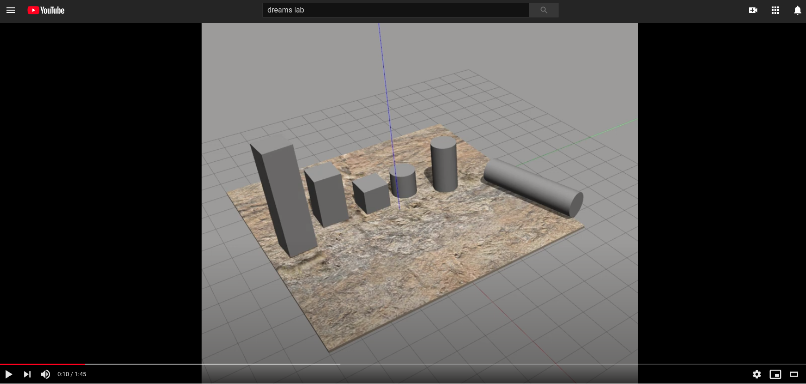
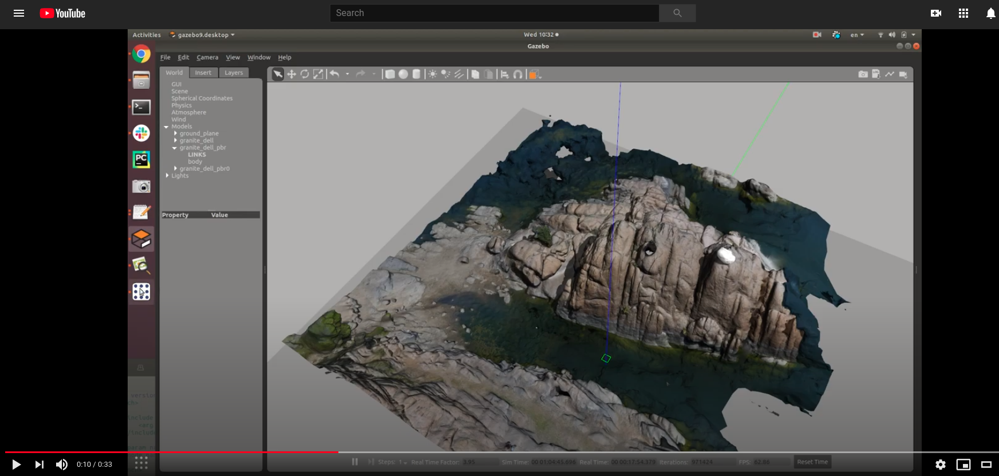
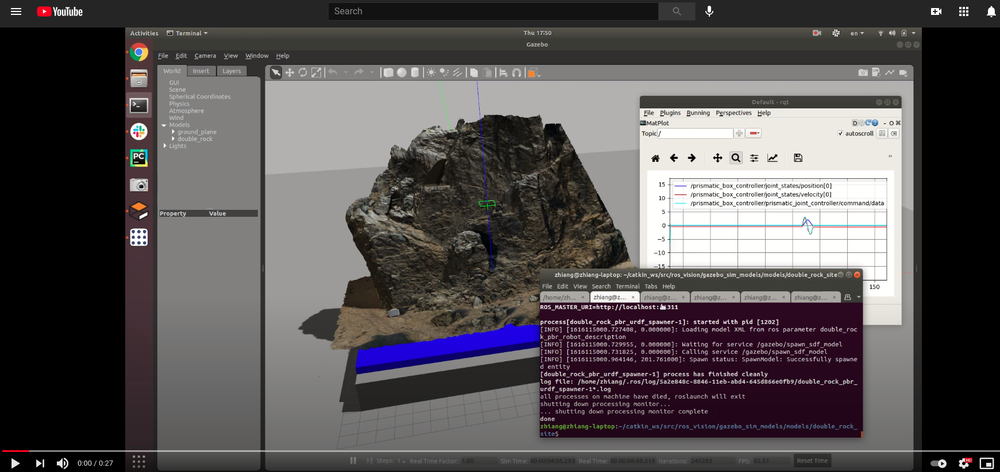
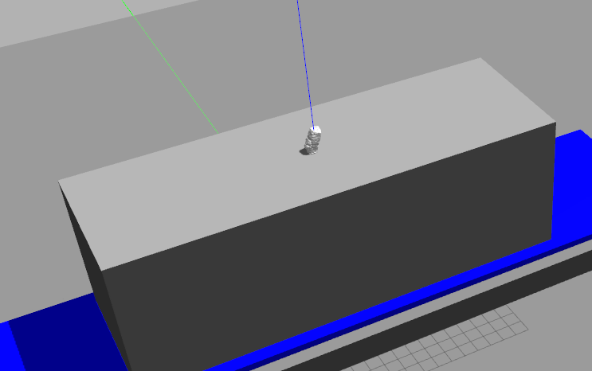
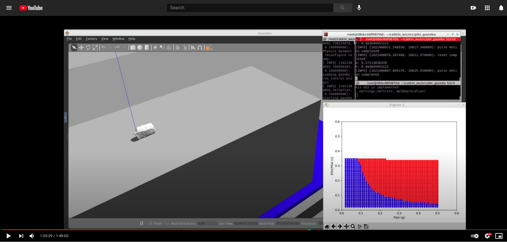
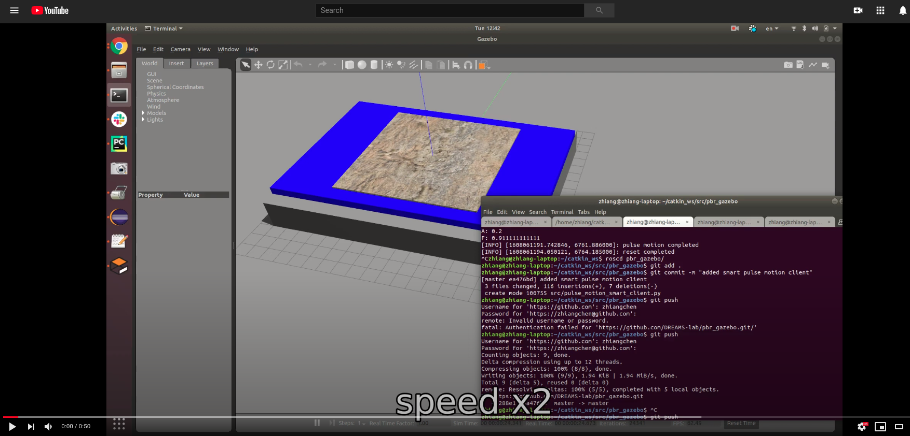
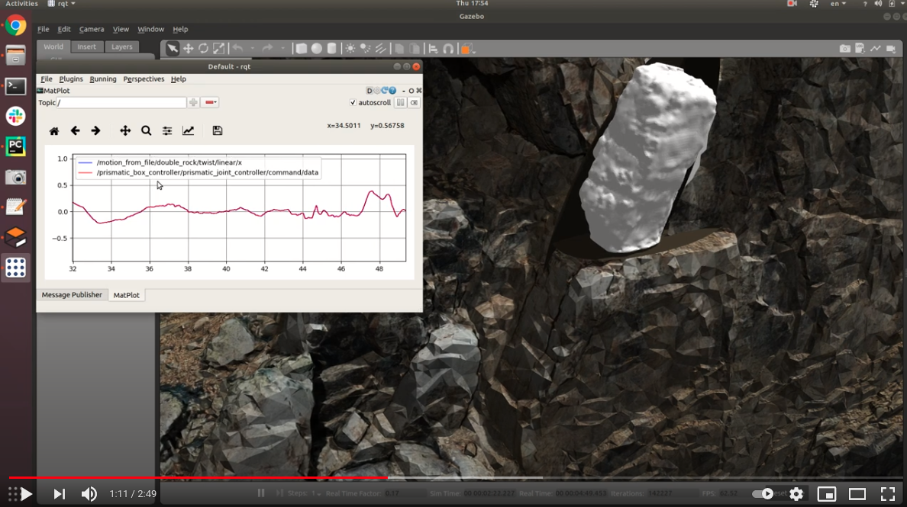

# pbr_gazebo
Precariously balanced rock gazebo simulation  
Zhiang Chen, zch@asu.edu

---
## Add Path
```
export GAZEBO_MODEL_PATH=~/catkin_ws/src/pbr_gazebo/models${GAZEBO_MODEL_PATH:+:${GAZEBO_MODEL_PATH}}$
```
## Download Models
1. [ros_vision](https://github.com/ZhiangChen/ros_vision)
2. [granite_dell.zip](https://download.openuas.us/granite_dell.zip)

## Simulation
### Simple Shake Table
[](https://www.youtube.com/watch?v=8tYpVeeXM_s&t=10s)
```
roslaunch pbr_gazebo prismatic_box.launch
rosrun pbr_gazebo pulse_motion_server.py
rosrun pbr_gazebo pulse_motion_client.py 1 2
```
The pulse motion is deployed by a cosine function: .  
There are two arguments required for pulse_motion_client.py. The first one is the amplitude of displacement, A; the second one is the fruquence of displacement, F. 

To reset shaking table displacement,
```
rosrun pbr_gazebo pulse_motion_client.py 0 0
```

`rqt` is recommended to plot the motion. There are three important topics:
```
/prismatic_box_controller/prismatic_joint_controller/command/data
/prismatic_box_controller/joint_states/velocity[0]
/prismatic_box_controller/joint_states/position[0]
```

To tune the PID parameters, [prismatic_box_controller.yaml](https://github.com/DREAMS-lab/pbr_gazebo/blob/master/config/prismatic_box_controller.yaml)


### Granite Dell
[](https://www.youtube.com/watch?v=9lwKEj10frs)
```
roslaunch pbr_gazebo granite_dell.launch
roslaunch pbr_gazebo prismatic_controller.launch
rosrun pbr_gazebo pulse_motion_server.py
rosrun pbr_gazebo pulse_motion_client.py 1 2
```
You might need to wait until `granite_dell` is fully launched in gazebo to launch the `prismatic_controller`.

To tune the PID parameters, [prismatic_controller_granite_dell.yaml](https://github.com/DREAMS-lab/pbr_gazebo/blob/master/config/prismatic_controller_granite_dell.yaml)

### Double Rock
[](https://www.youtube.com/watch?v=A3oJDmryM5A)

```
roslaunch pbr_gazebo double_rock.launch
rosrun pbr_gazebo pulse_motion_server.py
rosrun pbr_gazebo pulse_motion_client.py 1 2
```

### Double Rock PBR

```buildoutcfg
roslaunch pbr_gazebo prismatic_large_box.launch
roslaunch pbr_gazebo add_double_rock_pbr_2.launch
rosrun pbr_gazebo pulse_motion_server.py
```

#### Smart client
[](https://www.youtube.com/watch?v=hs_v9liaiWg&t=3s)
```buildoutcfg
roslaunch pbr_gazebo prismatic_large_box.launch
rosrun pbr_gazebo pulse_motion_server.py
rosrun pbr_gazebo pulse_motion_smart_client_double_rock.py --yaw 90
```
`pulse_motion_smart_client_double_rock.py` has one argument, the initial yaw (degrees) of PBR. 

### PBRs and Boxes
PBR and box models can be loaded after the environment has been loaded in Gazebo
```
roslaunch pbr_gazebo add_pbr.launch
roslaunch pbr_gazebo add_box.launch
```
There are [box models with different dimensions](https://github.com/DREAMS-lab/pbr_gazebo/tree/master/models/rock_models). They can be specified in `add_box.launch` file to be loaded.

## Pulse Motion
The pulse motion is deployed by a cosine function: . It is conducted by a ros action server, [pulse_motion_server.py](https://github.com/DREAMS-lab/pbr_gazebo/blob/master/src/pulse_motion_server.py). To send the motion commands, two action clients are supported. 
1. [pulse_motion_client.py](https://github.com/DREAMS-lab/pbr_gazebo/blob/master/src/pulse_motion_client.py): Single pulse motion. Two arguments are required for pulse_motion_client.py. The first one is the amplitude of displacement, A; the second one is the fruquence of displacement, F. e.g. `rosrun pbr_gazebo pulse_motion_client.py 1 2`.
2. [pulse_motion_smart_client.py](https://github.com/DREAMS-lab/pbr_gazebo/blob/master/src/pulse_motion_smart_client.py): Repeated pulse-motion experiments. It needs the lists of displacement amplitudes and frequences defined in the python file. Then it will repeat the experiment of loading PBR, triggering single pulse motion, deleting PBR, and resetting shake table. The following video shows that the experiments are automatically repeated in the simulation. 

[](https://www.youtube.com/watch?v=XEWoWZ7U458)

```
roslaunch pbr_gazebo prismatic_box.launch
rosrun pbr_gazebo pulse_motion_server.py
rosrun pbr_gazebo pulse_motion_smart_client.py
```
The lists of displacement amplitudes and frequences need to be defined in pulse_motion_smart_client.py.

## Realistic Shake Table Motion
```buildoutcfg
roslaunch pbr_gazebo double_rock.launch
rosrun pbr_gazebo motion_from_file.py
roslaunch pbr_gazebo add_double_rock_pbr.launch
rostopic pub /ground_motion_server/goal pbr_gazebo/AFActionGoal "header:
  seq: 0
  stamp:
    secs: 0
    nsecs: 0
  frame_id: ''
goal_id:
  stamp:
    secs: 0
    nsecs: 0
  id: ''
goal:
  A: 1.0
  F: 1.0"
```
When A*F = 0. the shake table position will be reset. Otherwise (A*F !=0), it will trigger ground motion from a .csv file where desired velocities are defined. 

[](https://www.youtube.com/watch?v=DQMvtCtxVjo)


---
## Install Motion Controller
```
apt-get update && apt-get upgrade
apt-get install ros-kinetic-ros-control
apt-get install ros-kinetic-gazebo-ros-pkgs ros-kinetic-gazebo-ros-control
apt-get install ros-kinetic-joint-state-controller
apt-get install ros-kinetic-effort-controllers
apt-get install ros-kinetic-position-controllers
```
---
More interesting videos can be found on our [Youtube playlist](https://www.youtube.com/playlist?list=PLQFQ6M344AWcVceGyqwvHDmvLtTxphPdQ)
